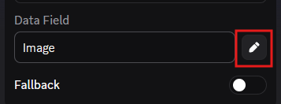

# OverWidget

A self-hosted Discord bot that pushes your live Overwatch stats directly to your Discord profile widget — updates every 5 minutes.


---

## Requirements

- [Node.js 18+](https://nodejs.org/)
- A Discord account with **Developer Mode** enabled
- An Overwatch account with a **public** Career Profile *(Options → Social → Career Profile: Public)*
- Chrome, Edge, or Firefox

---

## Setup

### 1. Clone and install

```bash
git clone https://github.com/BillMoney123/Overwidget
cd Overwidget
npm install
```

### 2. Install the Discord Widget Creator extension

This extension creates your Discord application and widget automatically.

1. Download or clone https://github.com/TheCreativeGod/Discord-Widgets-Extension
2. **Chrome / Edge / Brave**: `chrome://extensions` → Enable Developer Mode → Load unpacked → select the `chrome-extension/` folder
3. **Firefox**: `about:debugging#/runtime/this-firefox` → Load Temporary Add-on → select `firefox-extension/manifest.json`

### 3. Import the widget layout

1. Go to https://discord.com/developers/applications and reload the page once after installing the extension
2. Click the **Widget Creator** button in the bottom-right corner
3. Paste the full contents of **`widget-config.json`** from this repo into the JSON box
4. Click **Import** — the extension creates the application with the OverWidget layout and stat icons pre-configured
5. Complete any captcha / 2FA if prompted

> **Note:** After importing, all data fields will appear **empty** — this is expected. The bot hasn't pushed any stats yet. Click the **pencil icon** on each data field to confirm the mapping is correct.
>
> 
>
> Each field should look like this:
>
> | Field | Type | Expected value |
> |---|---|---|
> | Battletag | Text (dynamic) | `Battletag` |
> | PlayerTitle | Text (dynamic) | `PlayerTitle` |
> | Rank | Text (dynamic) | `Rank` |
> | Time_Played | Text (dynamic) | `Time_Played` |
> | Games_Played | Text (dynamic) | `Games_Played` |
> | Games_Won | Text (dynamic) | `Games_Won` |
> | Elims | Text (dynamic) | `Elims` |
> | Assists | Text (dynamic) | `Assists` |
> | Killstreak_Best | Text (dynamic) | `Killstreak_Best` |
> | Top_Hero | Text (dynamic) | `Top_Hero` |
> | Image | Image URL (dynamic) | `Image` |
> | RankIcon | Image URL (dynamic) | `RankIcon` |
>
> The stat icons (Untitled-1-01 through Untitled-1-06) are uploaded automatically on import — you don't need to touch those.

Once done, copy from the Developer Portal:
- **Application ID** → General Information page
- **Bot Token** → Bot page → Reset Token

### 4. Create a private image channel

The bot uploads processed hero portraits to a Discord channel.

1. Create a private text channel in your server (e.g. `#widget-images`)
2. Right-click the channel → **Copy Channel ID**

### 5. Configure `.env`

```bash
cp .env.example .env
```

```env
TOKEN=your_bot_token
CLIENT_ID=your_application_id
GUILD_ID=your_server_id
IMAGE_CHANNEL_ID=your_image_channel_id
```

> **User ID**: Discord Settings → Advanced → Developer Mode → right-click your name → Copy User ID  
> **Server ID**: right-click your server icon → Copy Server ID

### 6. Invite the bot

Replace `YOUR_CLIENT_ID` with your Application ID:

```
https://discord.com/oauth2/authorize?client_id=YOUR_CLIENT_ID&permissions=51200&scope=bot%20applications.commands
```

### 7. Deploy and start

```bash
npm run deploy   # register slash commands
npm start        # start the bot
```

The bot logs `Logged in as OverWidget#1234` when ready.

---

## Linking your Overwatch account

Once the bot is running, use these commands in your server:

```
/widget link <BattleTag#1234>   — register your account
/widget refresh                 — force-sync stats now
/widget unlink                  — remove your account
```

After running `/widget link`, the bot will reply with two browser console snippets to run and then prompt you to use `/widget refresh`. Once your stats have been pushed:

1. **Refresh** your Discord profile page
2. Go to **User Settings → Profiles → Edit Profile**
3. Scroll down to **Activity** and add the OverWidget widget

Stats sync automatically every 5 minutes.

---

## Commands

| Command | Description |
|---|---|
| `/widget link <battletag>` | Link your Overwatch account |
| `/widget refresh` | Force-sync your stats immediately |
| `/widget unlink` | Remove your account from OverWidget |
| `/owstats <battletag>` | Look up any player's stats |

---

## Troubleshooting

**Widget shows "Your game stats are still syncing. Keep playing!"**  
Run `/widget refresh` to push your stats immediately.

**"Player not found" error**  
Your Overwatch Career Profile must be set to **Public** in-game.

**Commands don't appear in Discord**  
Run `npm run deploy` again — global commands can take up to 1 hour to propagate.

---

## Support

If you find OverWidget useful, consider buying me a coffee!

[](https://ko-fi.com/billmonry12317218)
